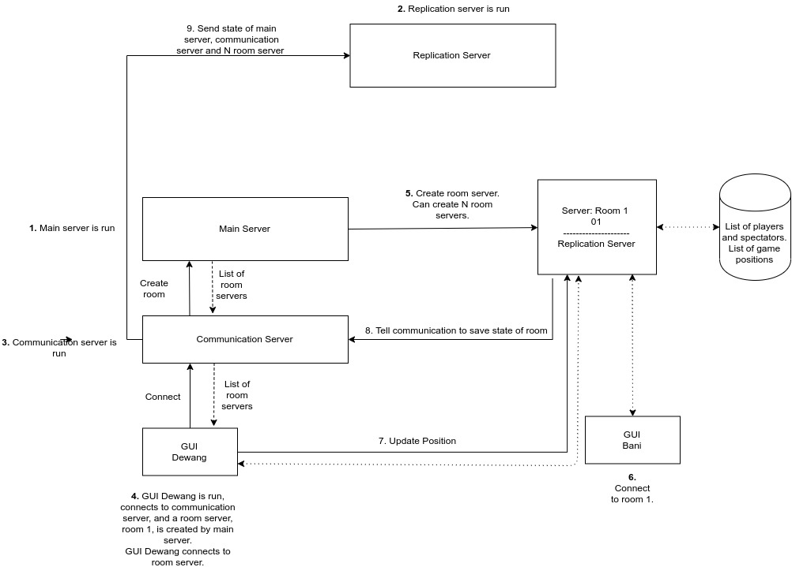
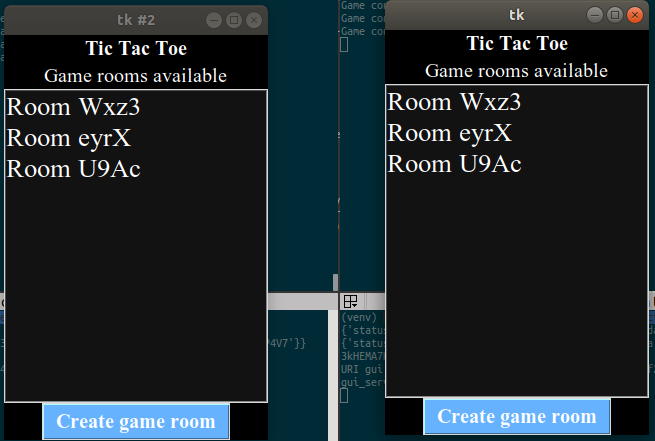
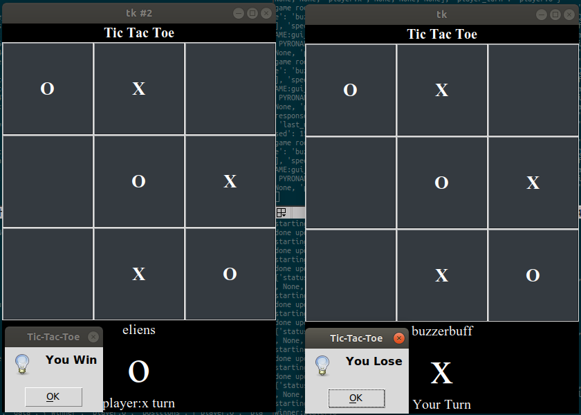

## Architecture

#### Details
- Main server : handle for N rooms (dynamically created and delete rooms)
- Communication server : communication protocol between server
- Replication server : always keep state of all server, spawn communication server and main server if get stopped
- Room server : actually an abstract server created by main server dynamically. handle game logic

#### Feature
- Play normal tictactoe
- Handle crash
- Handle replication
- Cool UI

#### System
- 1 room can be play only for 2 user, but 3rd - Nth player join as spectator
- if player left room in match, player can join again with username
- if communication server and main server is down. replication will automatically spawn a new communication server and main server with its state. so game still playing.
- if replication server is down. game still playing but cant handle if communication server and main server down.
- the game continues as long as not all servers down.

#### Snapshoot
room list

game ended

## Development
ps: use this branch for development server and client
#### Requirement
- (venv) python 3.6
- tkinter `sudo apt-get install python3.6-tk`
- environment `pip install -r requirement.txt`

#### How To Use
- Start your env
- Run command `pyro4-ns -n localhost -p 1337`
- Server
    - Run [main server](server/main_server.py)
    - Run [replication server](server/replication_server.py)
    - Run [communication server](server/communication_server.py)
- Client
    - Run [tictactoe](tictactoe.py)
    - Can run more than 1 client

## Production
#### How To Use
- Server
    - Change Branch to [dev](https://github.com/adisazhar123/tictactoe/tree/dev)
    - Run command `pyro4-ns -n [server ip address] -p 1337`
    - Change [this](https://github.com/adisazhar123/tictactoe/blob/5ff02b18a714ddceabf58becb7d1d8e49b5215f1/game/game_room_controller.py#L14), [this](https://github.com/adisazhar123/tictactoe/blob/5ff02b18a714ddceabf58becb7d1d8e49b5215f1/game/game_room_server.py#L7), [this](https://github.com/adisazhar123/tictactoe/blob/5ff02b18a714ddceabf58becb7d1d8e49b5215f1/game/game_room_server.py#L8), [this](https://github.com/adisazhar123/tictactoe/blob/5ff02b18a714ddceabf58becb7d1d8e49b5215f1/server/communication_server.py#L8), [this](https://github.com/adisazhar123/tictactoe/blob/5ff02b18a714ddceabf58becb7d1d8e49b5215f1/server/communication_server_controller.py#L19), [this](https://github.com/adisazhar123/tictactoe/blob/5ff02b18a714ddceabf58becb7d1d8e49b5215f1/server/main_server.py#L8), [this](https://github.com/adisazhar123/tictactoe/blob/5ff02b18a714ddceabf58becb7d1d8e49b5215f1/server/main_server_controller.py#L25), [this](https://github.com/adisazhar123/tictactoe/blob/5ff02b18a714ddceabf58becb7d1d8e49b5215f1/server/replication_controller.py#L19), [this](https://github.com/adisazhar123/tictactoe/blob/5ff02b18a714ddceabf58becb7d1d8e49b5215f1/server/replication_controller.py#L30), [this](https://github.com/adisazhar123/tictactoe/blob/5ff02b18a714ddceabf58becb7d1d8e49b5215f1/server/replication_server.py#L7), [this](https://github.com/adisazhar123/tictactoe/blob/5ff02b18a714ddceabf58becb7d1d8e49b5215f1/test.py#L15), [this](https://github.com/adisazhar123/tictactoe/blob/5ff02b18a714ddceabf58becb7d1d8e49b5215f1/test.py#L16) with server ip address. (soon we'll use env for simplicity :)
    
- Client (can be different machine)
    - Change Branch to [dev client](https://github.com/adisazhar123/tictactoe/tree/dev_client)
    - Run command `pyro4-ns -n [client ip address] -p 1337`)
    - Change [this](https://github.com/adisazhar123/tictactoe/blob/30b54a8e52ebb81bdbc7dcb0cd4bf250fc72cd76/tictactoe.py#L18)  and [this](https://github.com/adisazhar123/tictactoe/blob/30b54a8e52ebb81bdbc7dcb0cd4bf250fc72cd76/tictactoe.py#L429) with client ip address
    - Change [this](https://github.com/adisazhar123/tictactoe/blob/30b54a8e52ebb81bdbc7dcb0cd4bf250fc72cd76/tictactoe.py#L19) with server ip address
    - Run [tictactoe](https://github.com/adisazhar123/tictactoe/blob/dev_client/tictactoe.py)